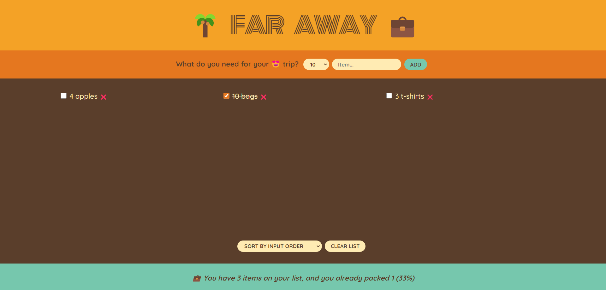

# 🌴 Far Away 💼

> ToDo app for far away trips

</img>

## Try it Live!

Check out the live app [Far Away](https://far-away-demo.vercel.app/)

## How to Use

**Adding items :** Select a number of items and type the name of the item for things you want to travel with then click on the add button.

**Check the finished item :** Click on the radio check box to marked it to finsihed.

## Tools Used

-   React
-   TypeScript
-   CSS
-   Vite

## Getting Started

1. Clone this repository.

    ```bash
    git clone https://github.com/mahmoud-mohsen-dev/far-away.git
    ```

2. Navigate to the Project Directory:
    ```bash
    cd far-away
    ```
3. Install Dependencies:

    ```bash
     npm install
    ```

4. Development Server

    ##### Start the Development Server:

    ```bash
    npm run dev
    ```

5. Open in your Browser:

    Open your web browser and go to http://localhost:3000 to see the app in action.

Now you have the "Far Away" app up and running on your local machine.

_This poject was part of The Ulitmate React Couse_
